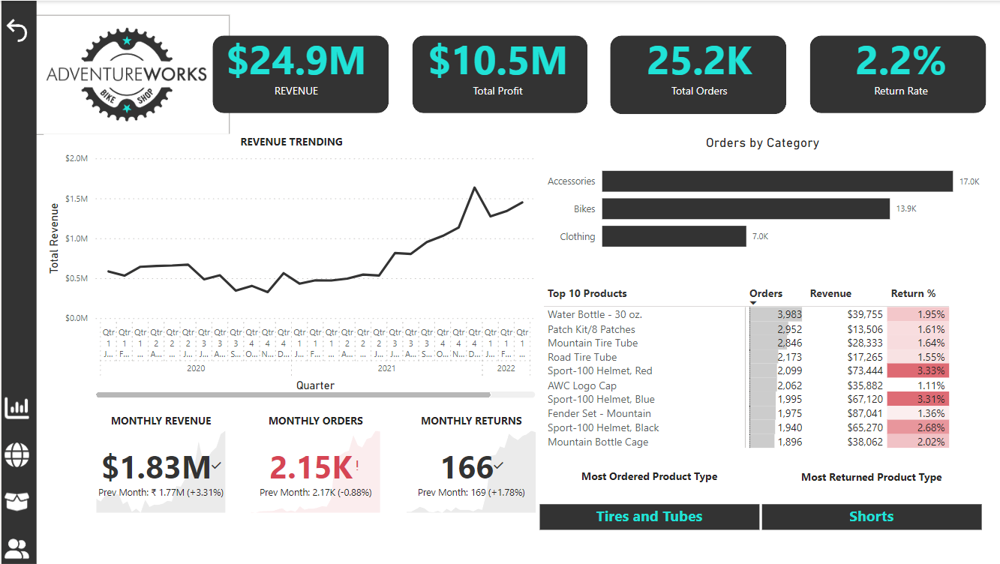

# Power BI Dashboard for Product Data Analysis

This repository contains the code and resources for a Power BI dashboard project focused on analyzing product sales, regional data, and customer demographics. The project involved integrating, cleaning, and transforming over 4 million records from diverse datasets to provide actionable insights through interactive dashboards.




## Project Overview

### Data Integration and Cleaning
- **Data Volume**: Over 4 million records from various sources.
- **Tools Used**: Power BI, Power Query.
- **Techniques**: Data cleaning, transformation, and integration.

### Data Modeling
- **Optimization Techniques**: Cardinality analysis, normalization, and star schema design.
- **Purpose**: To create an efficient relational data model for robust analysis and visualization in Power BI.

### Dashboard Development
- **Interactive Reports**: Developed in Power BI with features like slicers, filters, and drill-down functionality.
- **Key Performance Indicators (KPIs)**: Tracked KPIs for sales performance.
- **Sales Analysis**: Analyzed regional sales trends.
- **Customer Analysis**: Identified high-value customers based on demographics and purchasing behavior.

## Repository Contents

- `data/`: Contains sample datasets used for the analysis (ensure sensitive data is anonymized or use placeholder data).
- `powerbi_files/`: Power BI project files including the .pbix files for the dashboards.
- `scripts/`: Any supplementary scripts used for data preparation or transformation.
- `reports/`: Documentation and reports summarizing the findings and visualizations.
- `README.md`: Project overview and instructions.

## Getting Started

### Prerequisites

Ensure you have the following installed:
- Power BI Desktop

### Installation

Clone the repository:
```bash
git clone https://github.com/yourusername/powerbi-product-data-analysis.git
cd powerbi-product-data-analysis
```

### Usage

1. **Data Preparation**:
   - Place your datasets in the `data/` folder.
   - Use Power Query in Power BI to load and transform the data.

2. **Data Modeling**:
   - Follow the steps in the Power BI project files to apply cardinality analysis, normalization, and star schema design.
   
3. **Dashboard Creation**:
   - Open the .pbix files in Power BI Desktop.
   - Review and customize the interactive dashboards with slicers, filters, and drill-downs as needed.

4. **Analysis and Reporting**:
   - Utilize the interactive dashboards to track KPIs, analyze regional sales trends, and identify high-value customers.

## Contributing

Contributions are welcome! Please open an issue or submit a pull request for any improvements or new features.

## Acknowledgements

- Thanks to the Power BI community for the tools and resources that made this project possible.

---
